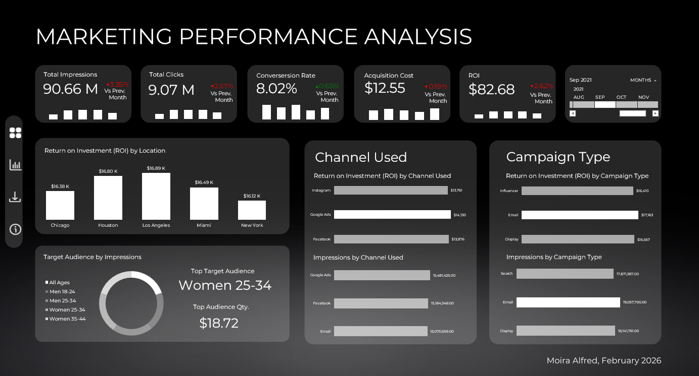

# Marketing Performance Analysis Dashboard  
Excel Based Marketing Analytics Project



## Table of Contents

1. [Project Overview](#1-project-overview)
2. [Business Context and Objectives](#2-business-context-and-objectives)
3. [Data Description](#3-data-description)
4. [Methodology](#4-methodology)
5. [KPI Framework and Theoretical Justification](#5-kpi-framework-and-theoretical-justification)
6. [Dashboard Design and Data Storytelling Logic](#6-dashboard-design-and-data-storytelling-logic)
7. [Technical Implementation](#7-technical-implementation)
8. [Skills Demonstrated](#8-skills-demonstrated)
9. [Key Insights and Findings](#9-key-insights-and-findings)
10. [Conclusion](#10-conclusion)

---

## 1. Project Overview

This project presents a structured Marketing Performance Dashboard developed entirely within Microsoft Excel, leveraging Power Query, Power Pivot, and DAX to deliver a fully interactive and dynamically filtered analytical environment. The dashboard consolidates marketing campaign performance indicators into a single view, enabling users to evaluate campaign reach, audience engagement, cost efficiency, and overall profitability across defined time periods within the 2021 campaign year.

The dashboard is organized around five core Key Performance Indicators; Total Impressions, Total Clicks, Average Conversion Rate, Average Acquisition Cost and Return on Investment — each of which is accompanied by its corresponding Previous Month value and a Month-over-Month percentage change indicator. A Timeline slicer connected to all relevant PivotTables enables temporal segmentation, allowing analysts to isolate specific date ranges and observe performance shifts across weekly intervals. Each KPI card additionally features an embedded mini bar trend chart, providing at-a-glance directional context without requiring the reader to navigate to a separate chart section.

Beyond the KPI summary, the dashboard answers a series of dimensional performance questions through dedicated visualizations: ROI by geographic location, channel effectiveness by both impressions and ROI, campaign type performance by both impressions and ROI, and target audience reach via a donut chart with a dynamically calculated center label.

The primary objective of this project is to demonstrate how Excel's modern analytical stack — Power Query for data preparation, Power Pivot for relational data modeling, and DAX for calculated measures can function as a complete marketing analytics platform capable of producing business-ready, enterprise-grade insights.

---

## 2. Business Context and Objectives

Marketing teams operating within data-driven organizations require reliable, fast-access reporting tools that translate raw campaign data into actionable intelligence. In many business environments, particularly those without dedicated BI infrastructure, Microsoft Excel remains the most accessible and widely adopted platform for analytical reporting. This project demonstrates that Excel, when combined with its modern data stack of Power Query and Power Pivot, is capable of supporting the kind of relational modeling, time intelligence, and dynamic filtering that are typically associated with purpose-built BI tools such as Power BI.

The business problem this dashboard solves is the fragmentation of marketing performance data across channels, campaign types, audience segments, and geographies. Without a consolidated view, analysts must manually reconcile metrics across separate reports, increasing the risk of error and slowing the pace at which decision-makers can respond to performance shifts. This dashboard eliminates that friction by presenting all relevant KPIs and dimensional breakdowns within a single, synchronized analytical environment.

The specific analytical objectives of this project are as follows. First, the dashboard enables continuous monitoring of aggregate campaign reach and engagement through total impression and click volume. Second, it surfaces efficiency and profitability signals through conversion rate, acquisition cost, and ROI metrics — each presented with month-over-month trend context. Third, the dimensional breakdowns by location, channel, campaign type, and target audience enable analysts to identify which segments and channels are driving or suppressing overall performance. Fourth, the use of time intelligence DAX measures introduces a temporal comparison layer that moves beyond static reporting toward active performance monitoring.

---

## 3. Data Description

The dataset used in this project was sourced from a publicly available marketing analysis case study and imported into Excel as a comma-separated values (CSV) file via Power Query. The dataset captures a full year of marketing campaign activity for the year 2021 and required minimal cleaning given the structured format in which it was exported. A supplementary Date Table was constructed within Power Query to enable time intelligence calculations in DAX.

| Attribute | Detail |
|---|---|
| **Data Source** | Publicly available marketing campaign dataset (CSV format) |
| **Volume** | Approximately 1,000 rows; 16 columns |
| **Date Range** | Full calendar year 2021 |
| **Key Fields** | Company, Campaign Type, Target Audience, Duration (days), Channel Used, Conversion Rate, Acquisition Cost, ROI, Location, Language, Clicks, Impressions, Engagement Score, Customer Segment, Date |
| **Pre-Calculated Fields** | Conversion Rate, Acquisition Cost, and ROI were present as pre-calculated columns in the source dataset and used directly as measure inputs |
| **Target Audience Segments** | Gender and age-band combinations (e.g., Men 18–25, Women 35–45) |
| **Customer Segments** | Fashionistas, Foodies, Health Awareness, Outdoor Adventurers, Tech Enthusiasts |
| **Campaign Channels** | Multiple digital channels including Google Ads, website, and others |
| **Geographic Coverage** | US cities: Chicago, Austin, California, Los Angeles, Miami, New York |
| **Languages** | English, French, German, Mandarin, Spanish |
| **Campaign Durations** | 15, 30, and 60-day campaign windows |
| **Date Table** | Constructed in Power Query from the Date column; includes Month Number, Month Name (abbreviated to 3 characters), Week of Month (prefixed "WK"), and Quarter of Year (prefixed "Q") |
| **Preprocessing Notes** | Duplicate dates removed from the Date Table to produce 365 unique date records. Empty rows removed as a precautionary step. Date column confirmed as a native date type to support Timeline slicer and DAX time intelligence. |

The marketing data table and the Date Table were loaded into Power Pivot as a relational data model, connected through a one-to-many relationship on the shared date field. This two-table model forms the foundation for all DAX time intelligence calculations in the dashboard.

---

## 4. Methodology

The analytical approach applied in this project followed four sequential stages: data ingestion and transformation in Power Query, relational data modeling in Power Pivot, DAX measure development, and dashboard design and layout. Each stage was executed to produce a reliable, maintainable, and visually professional analytical output.

**Stage 1 — Data Ingestion and Transformation via Power Query.** The raw CSV dataset was imported into Excel using Power Query's Text/CSV connector. Within the Power Query editor, the dataset was reviewed across its 16 columns and approximately 1,000 rows. No significant data quality issues were present. A duplicate of the marketing data query was created and transformed into a standalone Date Table by removing all columns except the Date field, eliminating duplicate date values to produce 365 unique records, and removing any empty rows. Additional date dimension columns were then derived: Month Number, Month Name (trimmed to the first three characters), Week of Month (prefixed with "WK"), and Quarter of Year (prefixed with "Q"). Both the marketing data table and the Date Table were loaded into the workbook using "Close & Load To" with "Only Create Connection" and "Add to Data Model" selected, making them available in Power Pivot without writing raw data directly to a worksheet.

**Stage 2 — Relational Data Modeling in Power Pivot.** Within the Power Pivot diagram view, a one-to-many relationship was established between the Date Table (the "one" side) and the marketing data table (the "many" side), joined on their shared date fields. This relational structure is a prerequisite for DAX time intelligence functions, which rely on a properly connected Date Table to traverse date hierarchies correctly. This two-table model replicates the data modeling approach used in enterprise BI tools, demonstrating that Excel's Power Pivot engine supports production-grade analytical modeling.

**Stage 3 — DAX Measure Development.** All KPI values were calculated as explicit DAX measures within Power Pivot rather than as PivotTable calculated fields or worksheet formulas. Five base measures were created using `SUM` for volume and aggregate metrics and `AVERAGE` for rate and cost metrics. Five Previous Month measures were then derived using `CALCULATE` combined with `DATEADD` at a minus-one-month interval. Finally, five Month-over-Month percentage change measures were computed using `DIVIDE` to compare each current measure against its corresponding Previous Month value. The `DIVIDE` function was used in place of direct division to handle zero-denominator scenarios gracefully. All 15 measures were validated by filtering the Timeline slicer across multiple months and confirming that current, previous, and percentage change values updated coherently.

**Stage 4 — Dashboard Design and Layout.** The visual dashboard was wireframed in Microsoft PowerPoint to allow flexible arrangement of shapes, icons, and layout elements before committing to the Excel canvas. A dark-themed color palette was selected. The wireframe was grouped, copied, and pasted onto the Visual sheet in Excel, where it was expanded to fit the available canvas. KPI cards were configured to display the current DAX measure value, the Month-over-Month percentage change, and an embedded mini bar trend chart showing weekly performance within the current period. Linked pictures were used to display KPI values in order to preserve conditional number formatting — a technique required because direct cell references strip custom format codes. Dimensional charts were constructed using an `IF(value = MAX(range), MAX(range), BLANK())` overlay formula to programmatically highlight the top-performing bar in each chart without manual formatting.

---

## 5. KPI Framework and Theoretical Justification

The five KPIs selected for this dashboard represent the foundational metrics used in digital and performance marketing analytics. Each addresses a distinct dimension of campaign performance — reach, engagement, conversion efficiency, cost efficiency, and profitability — and together they provide a comprehensive view of the campaign lifecycle. Critically, each KPI is presented not only as a current period value, but alongside its Previous Month baseline and a Month-over-Month percentage change, enabling both point-in-time assessment and trend-based evaluation within a single card.

---

### 5.1 Total Impressions

**Business Definition:** Total Impressions represents the cumulative number of times a campaign advertisement or asset was displayed to a target audience within the selected time period.

**Strategic Importance:** Impressions serve as the primary indicator of marketing reach and top-of-funnel activity. A high impression count confirms that the campaign is generating visibility at scale, which is a prerequisite for downstream engagement and conversion. Monitoring impressions month-over-month reveals whether reach is growing, plateauing, or contracting, and allows analysts to correlate reach volume with engagement outcomes.

**DAX Measures:**

```dax
Total Impressions = SUM(MarketingData[Impressions])

PM Impressions = CALCULATE([Total Impressions], DATEADD(DateTable[Date], -1, MONTH))

MoM% Impressions = DIVIDE([Total Impressions], [PM Impressions])
```

**Assumptions and Limitations:** This metric does not distinguish between unique and repeat impressions. A single user viewing the same advertisement multiple times contributes multiple impressions, which may inflate the headline figure without representing equivalent reach expansion.

---

### 5.2 Total Clicks

**Business Definition:** Total Clicks represents the cumulative number of times users actively engaged with a campaign asset by clicking through to the destination content or landing page.

**Strategic Importance:** Clicks are the first measurable signal of active audience interest and intent. Unlike impressions, which are passive exposure events, clicks reflect a deliberate user action. Tracking click volume alongside impressions provides the data required to evaluate Click-Through Rate implicitly, revealing the proportion of reach that translates into engagement.

**DAX Measures:**

```dax
Total Clicks = SUM(MarketingData[Clicks])

PM Clicks = CALCULATE([Total Clicks], DATEADD(DateTable[Date], -1, MONTH))

MoM% Clicks = DIVIDE([Total Clicks], [PM Clicks])
```

**Assumptions and Limitations:** Click volume alone does not confirm productive engagement. Clicks that do not result in downstream conversion activity may indicate misalignment between advertisement content and landing page experience, or may reflect accidental interactions.

---

### 5.3 Average Conversion Rate

**Business Definition:** Average Conversion Rate measures the proportion of clicks that resulted in a desired conversion outcome, averaged across all campaign records within the selected time period.

**Strategic Importance:** Conversion Rate is the most direct measure of campaign effectiveness at the point of user action. It reveals how successfully the campaign translates traffic into measurable business outcomes. A declining conversion rate may indicate creative fatigue, audience misalignment, or friction within the conversion pathway. This metric was pre-calculated in the source dataset and is aggregated using `AVERAGE` across records.

**DAX Measures:**

```dax
Avg Conversion Rate = AVERAGE(MarketingData[Conversion Rate])

PM Conversion Rate = CALCULATE([Avg Conversion Rate], DATEADD(DateTable[Date], -1, MONTH))

MoM% Conversion Rate = DIVIDE([Avg Conversion Rate], [PM Conversion Rate])
```

**Assumptions and Limitations:** Because this metric is sourced as a pre-calculated field and averaged across records, it represents the mean conversion rate across all campaigns in the period rather than an aggregate conversion count divided by aggregate clicks. Analysts should interpret this as a directional efficiency indicator rather than a precisely attributed conversion funnel metric.

---

### 5.4 Average Acquisition Cost

**Business Definition:** Average Acquisition Cost measures the average cost incurred per campaign to acquire a customer or achieve a conversion, averaged across all records within the selected time period.

**Strategic Importance:** Acquisition Cost is the central efficiency metric in performance marketing. It quantifies the financial cost of achieving each business outcome and enables comparison against revenue benchmarks. A rising acquisition cost without a corresponding increase in conversion value indicates deteriorating campaign efficiency and signals a need for optimization. This field was pre-calculated in the source dataset.

**DAX Measures:**

```dax
Avg Acquisition Cost = AVERAGE(MarketingData[Acquisition Cost])

PM Acquisition Cost = CALCULATE([Avg Acquisition Cost], DATEADD(DateTable[Date], -1, MONTH))

MoM% Acquisition Cost = DIVIDE([Avg Acquisition Cost], [PM Acquisition Cost])
```

**Assumptions and Limitations:** This metric reflects the mean acquisition cost across campaign records and does not weight by campaign size or spend volume. High-spend and low-spend campaigns contribute equally to the average, which may mask concentration effects.

---

### 5.5 Return on Investment (ROI)

**Business Definition:** Return on Investment measures the net financial return generated by each campaign relative to its cost, as pre-calculated in the source dataset and aggregated as a sum across all records within the selected period.

**Strategic Importance:** ROI is the ultimate measure of campaign profitability and the primary metric used by senior stakeholders to evaluate whether marketing investments are generating acceptable financial returns. Positive ROI confirms that campaigns are generating value above their cost. A declining ROI trend — even if still positive — signals that profitability is eroding and warrants investigation into which channels, campaign types, or audience segments are underperforming.

**DAX Measures:**

```dax
.ROI = SUM(MarketingData[ROI])

PM ROI = CALCULATE([.ROI], DATEADD(DateTable[Date], -1, MONTH))

MoM% ROI = DIVIDE([.ROI], [PM ROI])
```

> **Note:** The measure name `.ROI` uses a leading period to differentiate it from the existing `ROI` column name in the source dataset, avoiding naming conflicts within the DAX engine.

**Assumptions and Limitations:** Because ROI values are pre-calculated at the campaign record level and summed, this metric reflects aggregate campaign-level profitability rather than a value recalculated from raw revenue and spend figures. Multi-touch attribution effects and lag between spend and revenue realization are not accounted for in this implementation.

---

## 6. Dashboard Design and Data Storytelling Logic

The dashboard was designed using a structured visual hierarchy that guides the reader from executive-level summary metrics through to granular dimensional analysis. The design process began with a wireframe built in Microsoft PowerPoint, which provided a flexible environment for arranging layout elements, sizing components, and establishing the overall structure before committing anything to the Excel canvas. A dark-themed color palette was selected to differentiate the dashboard visually and improve the contrast of KPI values and chart data against the background. The wireframe was grouped, copied, and pasted onto the Visual sheet in Excel, where it was expanded to fit the full canvas — a workflow that allowed design decisions to be made freely before the constraints of the spreadsheet grid were introduced.

A left-side navigation panel was incorporated, containing icon-based buttons — linking to the Visual, Analysis, and Info sheets within the workbook. This navigation structure mirrors the conventions of modern BI dashboards and lends a product-grade quality to the presentation layer. The panel was kept intentionally narrow to maximize the available space for analytical content.

The five KPI cards occupy the top row of the dashboard, reflecting the principle that the most critical summary information should be immediately visible without scrolling or additional interaction. Each card presents three pieces of information simultaneously: the current period value, the Month-over-Month percentage change (rendered in green for improvement and red for decline via conditional custom number formatting), and an embedded mini bar trend chart showing weekly performance within the selected period. This three-layer design ensures that a reader can assess not only the current state of each metric, but also its directional trend and recent trajectory, all from a single card. Linked pictures were used to display the formatted KPI values on the dashboard — a deliberate technical choice to preserve the conditional color formatting that would otherwise be lost if standard cell references were used directly.

The Timeline slicer is positioned prominently and controls all PivotTable-connected views simultaneously. Its placement communicates clearly to the user that it functions as a global filter. Allowing different sections to respond to different filters independently would introduce the risk of contradictory readings across the same dashboard view — synchronization of all visuals to a single filter input is therefore a fundamental design requirement.

The lower section of the dashboard is divided into dimensional analysis visuals. ROI by Location presents geographic performance across six US cities, enabling analysts to identify which markets are driving or suppressing overall profitability. Channel Used by Impressions and Channel Used by ROI are presented as a paired set, allowing side-by-side evaluation of reach versus profitability by channel — a pairing that frequently reveals channels with high reach but low ROI, or vice versa. Campaign Type by Impressions and Campaign Type by ROI follow the same paired logic. Target Audience by Impressions is presented as a donut chart, with the highest-impression audience segment dynamically surfaced in the center using an `XLOOKUP` formula that identifies and retrieves the label corresponding to the maximum impression value. All bar charts apply a programmatic top-performer highlight using an `IF(value = MAX(range), MAX(range), BLANK())` overlay series, which automatically distinguishes the leading bar in a distinct accent color without requiring manual formatting updates when data changes under filtering.

---

## 7. Technical Implementation

| Component | Detail |
|---|---|
| **Primary Tool** | Microsoft Excel (Power Query, Power Pivot, PivotTables) |
| **Data Ingestion** | Power Query — CSV import via Text/CSV connector |
| **Data Transformation** | Power Query — Date Table construction, duplicate removal, column extraction (Month Number, Month Name, Week of Month, Quarter) |
| **Data Model** | Power Pivot — two-table relational model (Marketing Data + Date Table); one-to-many relationship on Date field |
| **Measure Language** | DAX — 15 explicit measures across 5 KPIs (Current Value, Previous Month, MoM%) |
| **Time Intelligence** | `CALCULATE` + `DATEADD(DateTable[Date], -1, MONTH)` for all Previous Month measures |
| **MoM% Calculation** | `DIVIDE([Current Measure], [PM Measure])` — uses DIVIDE to handle zero-denominator scenarios |
| **Sheet Structure** | Analysis (data and PivotTables), Visual (dashboard canvas), Info (reference/documentation) |
| **Dashboard Wireframing** | Microsoft PowerPoint — grouped and pasted onto Excel Visual sheet as editable shapes |
| **Visual Theme** | Dark mode with orange accent palette |
| **KPI Value Display** | Linked pictures — preserves conditional custom number formatting (color-coded MoM% and dynamic M/K suffix) |
| **Custom Number Format** | Dynamic format: `>=1,000,000` → millions; `>=1,000` → thousands; percentage and currency variants applied per metric |
| **Top-Bar Highlighting** | `IF(value = MAX(range), MAX(range), BLANK())` overlay series at 100% series overlap |
| **Donut Chart Center Label** | `XLOOKUP(MAX(range), values, labels)` — dynamically retrieves the top-performing audience segment name |
| **Filtering Mechanism** | Timeline slicer connected to all PivotTables via shared Power Pivot data model |
| **Navigation** | Icon-based buttons linking to Analysis, Visual, and Info sheets |

The relational data model constructed in Power Pivot is the architectural foundation that distinguishes this project from a conventional single-table Excel workbook. By separating the Date Table from the marketing data and establishing a formal relationship between them, the model enables DAX time intelligence functions — particularly `DATEADD` — to operate correctly. Without a properly connected Date Table, Previous Month calculations would not produce reliable results across all filter states. This modeling approach mirrors the dimensional modeling conventions used in enterprise analytics environments, applied within Excel's native Power Pivot engine.

The decision to use linked pictures for KPI value display, rather than direct cell references or text boxes, reflects a specific technical constraint: conditional number formatting applied to a cell — such as dynamic M/K suffix formatting or red/green MoM% color coding — is not preserved when that cell's value is referenced in another location on the sheet. By capturing the formatted cell region as a linked picture, the dashboard retains the full visual formatting while remaining dynamically responsive to all slicer and Timeline filter inputs.

---

## 8. Skills Demonstrated

This project reflects proficiency across the full analytical workflow — from raw data ingestion through relational modeling, DAX measure development, and professional dashboard delivery. On the data engineering side, the project demonstrates practical competency with Power Query for structured data transformation, including column extraction, duplicate removal, and the construction of a dedicated Date Table from a transactional dataset. The establishment of a relational data model in Power Pivot — connecting the Date Table to the marketing data via a one-to-many relationship — demonstrates an understanding of dimensional modeling principles that extends well beyond conventional spreadsheet usage.

On the analytical side, the project demonstrates the ability to translate business performance questions into DAX measures, including time intelligence logic for month-over-month comparison using `CALCULATE` and `DATEADD`. The dashboard design process — from wireframing in PowerPoint through to the application of linked pictures, programmatic bar highlighting via overlay series, and dynamic donut chart center labels via `XLOOKUP` — reflects a considered approach to data storytelling that balances analytical depth with visual accessibility and clarity.

**Core Skills:** DAX Measure Development and Time Intelligence (Power Pivot); Relational Data Modeling and Power Query Transformation; Marketing Performance Analytics and KPI Framework Design; Dashboard Design, Wireframing, and Data Storytelling; Advanced Excel Visualization Techniques (Linked Pictures, Dynamic Chart Formatting, Custom Number Formatting)

---

## 9. Key Insights and Findings

The dashboard structure is designed to surface analytically significant insights across multiple dimensions of campaign performance, enabling both executive-level summary review and operational diagnostic investigation.

At the reach and engagement level, the combination of Total Impressions and Total Clicks — alongside their Month-over-Month percentage changes — enables analysts to assess whether reach growth is translating into proportional engagement growth. Divergence between impression growth and click growth is a key diagnostic signal: sustained high impressions with flat or declining clicks suggests creative fatigue or audience misalignment, warranting a review of advertisement content or targeting parameters. The embedded weekly trend bars within each KPI card surface intra-month patterns that would not be visible from a monthly aggregate alone.

At the efficiency level, the Average Conversion Rate and Average Acquisition Cost metrics — each displayed alongside their Previous Month baseline — enable analysts to track whether campaign efficiency is improving or deteriorating over time. A pattern of rising acquisition cost alongside declining conversion rate is a compounding deterioration signal that demands strategic intervention, as it indicates that the campaign is simultaneously becoming more expensive to run and less effective at converting that spend into outcomes.

At the profitability level, ROI by Location provides geographic granularity that the top-line ROI KPI card cannot. Cities where ROI underperforms relative to the aggregate may indicate localized competitive pressure, audience misalignment, or channel mix inefficiencies specific to that market — all of which are actionable at the campaign planning level.

The paired Channel Used and Campaign Type charts — each presented for both Impressions and ROI — are particularly valuable for identifying efficiency mismatches. A channel or campaign type that ranks highly by impressions but poorly by ROI is consuming reach budget without generating proportional financial return. Conversely, a channel with moderate impressions but high ROI represents an underinvested high-efficiency opportunity. The `IF/MAX` programmatic highlighting applied to each bar chart ensures that the top-performing category is immediately identifiable regardless of which month is selected in the Timeline slicer.

The Target Audience donut chart, with its `XLOOKUP`-driven center label, provides at-a-glance identification of the dominant reach segment, which can be cross-referenced against ROI performance to assess whether the highest-reach audience is also the highest-value audience — a distinction that frequently drives significant shifts in targeting and budget allocation strategy.

---

## 10. Conclusion

This Marketing Performance Dashboard demonstrates that Microsoft Excel's modern analytical stack — Power Query, Power Pivot, and DAX — is capable of supporting the kind of relational data modeling, time intelligence, and dynamic reporting that is typically associated with dedicated business intelligence platforms. Through the deliberate combination of a two-table relational data model, 15 explicit DAX measures spanning current value, Previous Month baseline, and Month-over-Month comparison, and a professionally designed dark-themed dashboard canvas, the project delivers a production-grade analytical environment built entirely within Excel.

The project reflects a disciplined end-to-end methodology: from structured data ingestion and transformation via Power Query, through relational modeling and measure validation in Power Pivot, to wireframe-driven dashboard design and technically considered visualization choices. Each decision — from the use of linked pictures to preserve conditional formatting, to the `IF/MAX` overlay formula for programmatic bar highlighting, to the `XLOOKUP`-driven donut chart label — was made in service of analytical accuracy, visual clarity, and user-oriented design.

Beyond its functional utility as a marketing performance monitoring tool, this project illustrates a broader analytical philosophy: that the most effective dashboards are not those that display the most information, but those that present the right information at the right level of detail, in a format that supports fast, confident decision-making. This dashboard was designed with that principle as its foundation.

---

*This report was prepared as part of a data analytics portfolio. The dataset used in this project was sourced from a publicly available marketing analysis case study.*
